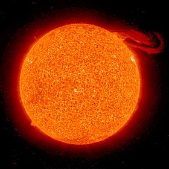

# Soleil

le soleil est brillant

trouvée sur [wikipedia]((https://commons.wikimedia.org/wiki/File:Solar_prominence_from_STEREO_spacecraft_September_29,_2008.jpg?uselang=fr).

## Caractéristiques

- Masse : 1.989 x 1030 kg
- Diamètre : 1 392 684 km

