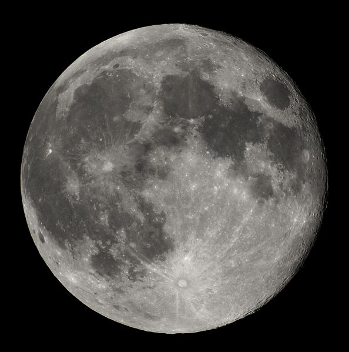

# lune

la lune est un satelite

trouvée sur [wikipedia](https://fr.vikidia.org/wiki/Lune#/media/File:Full_Moon_Luc_Viatour.jpg).

## Caractéristiques

- Masse : 1.989 x 1030 kg
- Diamètre : 1 392 684 km

